# 📊 Markdown Render Benchmark

## Benchmarks with no plugins.

```mermaid
xychart-beta
    title "Render Speed Comparison (Ops/sec)"
    x-axis ["short.md", "medium.md", "long.md", "All files"]
    y-axis "Δ from react-markdown (%)"
    line [20.933031887463496, -3.684453302257641, -8.930260721316925, -3.80565987816402]  %% difference percent
```

Detailed Tables

### [sample.md](./lib/fixtures/sample.md)

| Library               | Ops/sec |   ±% | Δ from baseline | Memory (KB) |
| --------------------- | ------: | ---: | --------------: | ----------: |
| `react-markdown`      |   42.98 | 2.51 |            0.0% |   coming... |
| `@m2d/react-markdown` |   42.75 | 3.15 |           -0.5% |   coming... |

### [short.md](./lib/fixtures/short.md)

| Library               | Ops/sec |   ±% | Δ from baseline | Memory (KB) |
| --------------------- | ------: | ---: | --------------: | ----------: |
| `react-markdown`      | 1851.94 | 2.83 |            0.0% |   coming... |
| `@m2d/react-markdown` | 1531.38 | 4.09 |          -17.3% |   coming... |

### [medium.md](./lib/fixtures/medium.md)

| Library               | Ops/sec |   ±% | Δ from baseline | Memory (KB) |
| --------------------- | ------: | ---: | --------------: | ----------: |
| `@m2d/react-markdown` |  286.57 | 4.25 |            3.8% |   coming... |
| `react-markdown`      |  276.01 | 4.37 |            0.0% |   coming... |

### [long.md](./lib/fixtures/long.md)

| Library               | Ops/sec |   ±% | Δ from baseline | Memory (KB) |
| --------------------- | ------: | ---: | --------------: | ----------: |
| `@m2d/react-markdown` |   20.64 | 4.37 |            9.8% |   coming... |
| `react-markdown`      |   18.79 | 4.89 |            0.0% |   coming... |

### [short-simple.md](./lib/fixtures/short-simple.md)

| Library               | Ops/sec |   ±% | Δ from baseline | Memory (KB) |
| --------------------- | ------: | ---: | --------------: | ----------: |
| `react-markdown`      |  983.57 | 3.14 |            0.0% |   coming... |
| `@m2d/react-markdown` |  975.21 | 3.63 |           -0.8% |   coming... |

### [medium-formatting.md](./lib/fixtures/medium-formatting.md)

| Library               | Ops/sec |   ±% | Δ from baseline | Memory (KB) |
| --------------------- | ------: | ---: | --------------: | ----------: |
| `react-markdown`      |  645.43 | 2.25 |            0.0% |   coming... |
| `@m2d/react-markdown` |  611.69 | 3.01 |           -5.2% |   coming... |

### [long-tutorial.md](./lib/fixtures/long-tutorial.md)

| Library               | Ops/sec |   ±% | Δ from baseline | Memory (KB) |
| --------------------- | ------: | ---: | --------------: | ----------: |
| `@m2d/react-markdown` |  390.72 | 2.80 |            8.1% |   coming... |
| `react-markdown`      |  361.52 | 2.52 |            0.0% |   coming... |

### [gfm-complexity.md](./lib/fixtures/gfm-complexity.md)

| Library               | Ops/sec |   ±% | Δ from baseline | Memory (KB) |
| --------------------- | ------: | ---: | --------------: | ----------: |
| `react-markdown`      |  825.41 | 2.34 |            0.0% |   coming... |
| `@m2d/react-markdown` |  771.53 | 3.48 |           -6.5% |   coming... |

### [deeply-nested-lists.md](./lib/fixtures/deeply-nested-lists.md)

| Library               | Ops/sec |   ±% | Δ from baseline | Memory (KB) |
| --------------------- | ------: | ---: | --------------: | ----------: |
| `react-markdown`      |  634.68 | 3.02 |            0.0% |   coming... |
| `@m2d/react-markdown` |  614.41 | 3.39 |           -3.2% |   coming... |

### [site-content.md](./lib/fixtures/site-content.md)

| Library               | Ops/sec |   ±% | Δ from baseline | Memory (KB) |
| --------------------- | ------: | ---: | --------------: | ----------: |
| `react-markdown`      |  649.71 | 2.27 |            0.0% |   coming... |
| `@m2d/react-markdown` |  640.20 | 2.69 |           -1.5% |   coming... |

### [All files](./lib/fixtures/All files)

| Library                             | Ops/sec |   ±% | Δ from baseline | Memory (KB) |
| ----------------------------------- | ------: | ---: | --------------: | ----------: |
| `@m2d/react-markdown`               |   11.36 | 3.68 |            4.0% |   coming... |
| `@m2d/react-markdown as nested jsx` |   11.18 | 3.79 |            2.3% |   coming... |
| `react-markdown`                    |   10.93 | 3.83 |            0.0% |   coming... |

## Benchmarks with remark-gfm, remark-math, and remark-frontmatter plugins.

```mermaid
xychart-beta
    title "Render Speed Comparison (Ops/sec)"
    x-axis ["short.md", "medium.md", "long.md", "All files"]
    y-axis "Δ from react-markdown (%)"
    line [9.31160305155029, -3.101949323175291, -4.614687997030218, 3.2522610156685263]  %% difference percent
```

Detailed Tables

### [sample.md](./lib/fixtures/sample.md)

| Library               | Ops/sec |   ±% | Δ from baseline | Memory (KB) |
| --------------------- | ------: | ---: | --------------: | ----------: |
| `@m2d/react-markdown` |   29.08 | 2.16 |            4.4% |   coming... |
| `react-markdown`      |   27.87 | 1.85 |            0.0% |   coming... |

### [short.md](./lib/fixtures/short.md)

| Library               | Ops/sec |   ±% | Δ from baseline | Memory (KB) |
| --------------------- | ------: | ---: | --------------: | ----------: |
| `react-markdown`      | 1074.72 | 1.35 |            0.0% |   coming... |
| `@m2d/react-markdown` |  983.17 | 1.37 |           -8.5% |   coming... |

### [medium.md](./lib/fixtures/medium.md)

| Library               | Ops/sec |   ±% | Δ from baseline | Memory (KB) |
| --------------------- | ------: | ---: | --------------: | ----------: |
| `@m2d/react-markdown` |  184.12 | 2.91 |            3.2% |   coming... |
| `react-markdown`      |  178.41 | 2.81 |            0.0% |   coming... |

### [long.md](./lib/fixtures/long.md)

| Library               | Ops/sec |   ±% | Δ from baseline | Memory (KB) |
| --------------------- | ------: | ---: | --------------: | ----------: |
| `@m2d/react-markdown` |   16.56 | 3.59 |            4.8% |   coming... |
| `react-markdown`      |   15.80 | 3.53 |            0.0% |   coming... |

### [short-simple.md](./lib/fixtures/short-simple.md)

| Library               | Ops/sec |   ±% | Δ from baseline | Memory (KB) |
| --------------------- | ------: | ---: | --------------: | ----------: |
| `react-markdown`      |  631.39 | 1.18 |            0.0% |   coming... |
| `@m2d/react-markdown` |  598.69 | 1.28 |           -5.2% |   coming... |

### [medium-formatting.md](./lib/fixtures/medium-formatting.md)

| Library               | Ops/sec |   ±% | Δ from baseline | Memory (KB) |
| --------------------- | ------: | ---: | --------------: | ----------: |
| `@m2d/react-markdown` |  426.92 | 1.14 |          113.4% |   coming... |
| `react-markdown`      |  200.07 | 7.84 |            0.0% |   coming... |

### [long-tutorial.md](./lib/fixtures/long-tutorial.md)

| Library               | Ops/sec |   ±% | Δ from baseline | Memory (KB) |
| --------------------- | ------: | ---: | --------------: | ----------: |
| `react-markdown`      |  235.69 | 1.57 |            0.0% |   coming... |
| `@m2d/react-markdown` |  193.32 | 9.92 |          -18.0% |   coming... |

### [gfm-complexity.md](./lib/fixtures/gfm-complexity.md)

| Library               | Ops/sec |   ±% | Δ from baseline | Memory (KB) |
| --------------------- | ------: | ---: | --------------: | ----------: |
| `react-markdown`      |  418.04 | 2.50 |            0.0% |   coming... |
| `@m2d/react-markdown` |  414.09 | 3.00 |           -0.9% |   coming... |

### [deeply-nested-lists.md](./lib/fixtures/deeply-nested-lists.md)

| Library               | Ops/sec |   ±% | Δ from baseline | Memory (KB) |
| --------------------- | ------: | ---: | --------------: | ----------: |
| `@m2d/react-markdown` |  415.30 | 1.70 |            0.8% |   coming... |
| `react-markdown`      |  411.96 | 1.81 |            0.0% |   coming... |

### [site-content.md](./lib/fixtures/site-content.md)

| Library               | Ops/sec |   ±% | Δ from baseline | Memory (KB) |
| --------------------- | ------: | ---: | --------------: | ----------: |
| `react-markdown`      |  457.94 | 1.41 |            0.0% |   coming... |
| `@m2d/react-markdown` |  445.84 | 1.25 |           -2.6% |   coming... |

### [All files](./lib/fixtures/All files)

| Library                             | Ops/sec |   ±% | Δ from baseline | Memory (KB) |
| ----------------------------------- | ------: | ---: | --------------: | ----------: |
| `react-markdown`                    |    8.17 | 3.15 |            0.0% |   coming... |
| `@m2d/react-markdown as nested jsx` |    8.10 | 2.90 |           -0.9% |   coming... |
| `@m2d/react-markdown`               |    7.92 | 3.33 |           -3.1% |   coming... |

## Benchmarks with remark-gfm, and rehype-raw plugins.

```mermaid
xychart-beta
    title "Render Speed Comparison (Ops/sec)"
    x-axis ["short.md", "medium.md", "long.md", "All files"]
    y-axis "Δ from react-markdown (%)"
    line [18.422287153083772, 1.012467822272033, -2.8087334427907673, -3.1858839487054995]  %% difference percent
```

Detailed Tables

### [sample.md](./lib/fixtures/sample.md)

| Library               | Ops/sec |   ±% | Δ from baseline | Memory (KB) |
| --------------------- | ------: | ---: | --------------: | ----------: |
| `react-markdown`      |   24.55 | 1.49 |            0.0% |   coming... |
| `@m2d/react-markdown` |   24.18 | 1.94 |           -1.5% |   coming... |

### [short.md](./lib/fixtures/short.md)

| Library               | Ops/sec |   ±% | Δ from baseline | Memory (KB) |
| --------------------- | ------: | ---: | --------------: | ----------: |
| `react-markdown`      | 1031.11 | 1.14 |            0.0% |   coming... |
| `@m2d/react-markdown` |  870.71 | 1.46 |          -15.6% |   coming... |

### [medium.md](./lib/fixtures/medium.md)

| Library               | Ops/sec |   ±% | Δ from baseline | Memory (KB) |
| --------------------- | ------: | ---: | --------------: | ----------: |
| `react-markdown`      |  164.38 | 2.44 |            0.0% |   coming... |
| `@m2d/react-markdown` |  162.73 | 2.56 |           -1.0% |   coming... |

### [long.md](./lib/fixtures/long.md)

| Library               | Ops/sec |   ±% | Δ from baseline | Memory (KB) |
| --------------------- | ------: | ---: | --------------: | ----------: |
| `@m2d/react-markdown` |   14.42 | 3.56 |            2.9% |   coming... |
| `react-markdown`      |   14.02 | 3.40 |            0.0% |   coming... |

### [short-simple.md](./lib/fixtures/short-simple.md)

| Library               | Ops/sec |   ±% | Δ from baseline | Memory (KB) |
| --------------------- | ------: | ---: | --------------: | ----------: |
| `react-markdown`      |  578.70 | 1.43 |            0.0% |   coming... |
| `@m2d/react-markdown` |  554.78 | 1.03 |           -4.1% |   coming... |

### [medium-formatting.md](./lib/fixtures/medium-formatting.md)

| Library               | Ops/sec |   ±% | Δ from baseline | Memory (KB) |
| --------------------- | ------: | ---: | --------------: | ----------: |
| `react-markdown`      |  422.17 | 1.08 |            0.0% |   coming... |
| `@m2d/react-markdown` |  402.98 | 1.07 |           -4.5% |   coming... |

### [long-tutorial.md](./lib/fixtures/long-tutorial.md)

| Library               | Ops/sec |   ±% | Δ from baseline | Memory (KB) |
| --------------------- | ------: | ---: | --------------: | ----------: |
| `@m2d/react-markdown` |  212.74 | 1.30 |            0.3% |   coming... |
| `react-markdown`      |  212.08 | 1.18 |            0.0% |   coming... |

### [gfm-complexity.md](./lib/fixtures/gfm-complexity.md)

| Library               | Ops/sec |   ±% | Δ from baseline | Memory (KB) |
| --------------------- | ------: | ---: | --------------: | ----------: |
| `react-markdown`      |  384.92 | 1.79 |            0.0% |   coming... |
| `@m2d/react-markdown` |  375.10 | 2.09 |           -2.6% |   coming... |

### [deeply-nested-lists.md](./lib/fixtures/deeply-nested-lists.md)

| Library               | Ops/sec |   ±% | Δ from baseline | Memory (KB) |
| --------------------- | ------: | ---: | --------------: | ----------: |
| `react-markdown`      |  392.58 | 1.16 |            0.0% |   coming... |
| `@m2d/react-markdown` |  264.71 | 8.59 |          -32.6% |   coming... |

### [site-content.md](./lib/fixtures/site-content.md)

| Library               | Ops/sec |   ±% | Δ from baseline | Memory (KB) |
| --------------------- | ------: | ---: | --------------: | ----------: |
| `react-markdown`      |  435.07 | 1.31 |            0.0% |   coming... |
| `@m2d/react-markdown` |  411.96 | 1.37 |           -5.3% |   coming... |

### [All files](./lib/fixtures/All files)

| Library                             | Ops/sec |    ±% | Δ from baseline | Memory (KB) |
| ----------------------------------- | ------: | ----: | --------------: | ----------: |
| `@m2d/react-markdown`               |    7.46 |  2.98 |            3.3% |   coming... |
| `react-markdown`                    |    7.22 |  2.59 |            0.0% |   coming... |
| `@m2d/react-markdown as nested jsx` |    5.05 | 12.56 |          -30.0% |   coming... |

