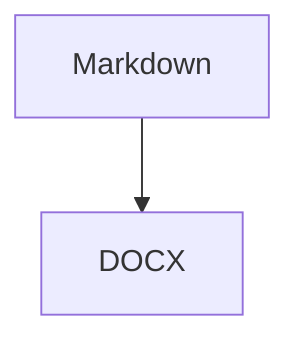

# GitHub Flavored Markdown Test

- [x] Task completed
- [ ] Task pending

## Table Example

| Column A | Column B |
|----------|----------|
| Hello    | **Bold** |
| `code`   | ~strike~ |

Autolink: <https://mayank-chaudhari.vercel.app>

~~Strikethrough~~ is supported.

Math: $E = mc^2$
